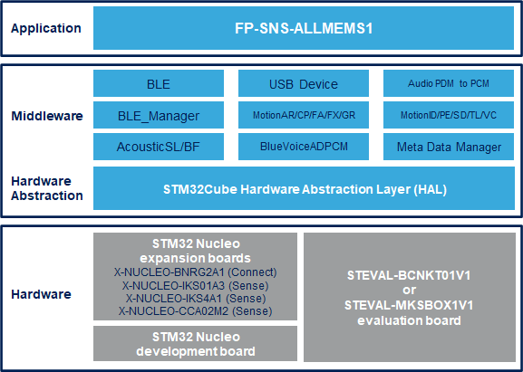

# FP-SNS-ALLMEMS1 Firmware Package

The FP-SNS-ALLMEMS1 is an STM32 ODE function pack. Thanks to this package you can connect your IoT node to a smartphone using BLE, and by using a suitable Android or iOS application
such as the ST BLE Sensor app, you can visualize real-time environmental sensor data, motion sensor data, digital microphone levels, and battery level.
With this package you can record on SD card the enviromental sensor data, motion sensor data and digital microphone levels.
The package also allows to perform advanced functionality such as voice communication over BLE, sound source localization and acoustic beam forming using inputs from multiple microphones,
as well sensor data fusion and accelerometer-based real-time activity recognition, gesture recognition, motion Intensity recognition.
Moreover provides real-time information about: the user current pose based on data from a device, the user working mode (sitting at the desk or standing desk position),
the tilt angles of the user device, the repetition quantity of various fitness activities performed by a user, the vertical movement.
This package, together with the suggested combination of STM32 and ST devices can be used, for example, to develop wearable applications, and, more in general smart things applications.

The software runs on the STM32 microcontroller and includes all the necessary drivers to recognize the devices on the STM32 Nucleo development board and expansion boards,
as well as on the STEVAL-BCNKT01V1 and STEVAL-MKS1BOX1 evaluation boards

The expansion is built on STM32Cube software technology to ease portability across different STM32 microcontrollers.

**FP-SNS-ALLMEMS1 software features**:

- Complete applications to develop node with BLE connectivity, microphone, environmental and motion sensors, and perform real-time monitoring of sensors and audio data

- MotionAR software provides real-time activity recognition

- MotionCP software provides real-time carry position recognition (feature not available on NUCLEO-F401RE, NUCLEO-F446RE and STEVAL-BCNKT01V1)

- MotionFA software provides real-time information about the repetition quantity of various fitness activities performed by a user (feature not available on NUCLEO-F446RE, NUCLEO-F401RE and STEVAL-BCNKT01V1)

- MotionFX (iNEMOEngine PRO) real-time motion-sensor data fusion

- MotionGR software provides real-time gesture recognition (feature not available on NUCLEO-F401RE, NUCLEO-F446RE and STEVAL-BCNKT01V1)

- MotionID software provides real-time Motion Intensity recognition (feature not available on NUCLEO-F446RE, NUCLEO-F401RE and STEVAL-BCNKT01V1)

- MotionPE software provides real-time information about the user current pose based on data from a device (feature not available on NUCLEO-F446RE, NUCLEO-F401RE and STEVAL-BCNKT01V1)

- MotionSD software provides real-time information about the user working mode (sitting at the desk or standing desk position) (feature not available on NUCLEO-F446RE, NUCLEO-F401RE and STEVAL-BCNKT01V1)

- MotionTL software provides real-time information about the tilt angles of the user device (feature not available on NUCLEO-F446RE, NUCLEO-F401RE and STEVAL-BCNKT01V1)

- MotionVC software provides real-time information about the vertical movement (feature not available on NUCLEO-F446RE, NUCLEO-F401RE and STEVAL-BCNKT01V1)

- AcousticSL software provides real-time audio source localization software that estimates the direction of arrival of audio sources using data acquired by two digital MEMS microphones (feature not available on STEVAL-STLKT01V1 and STEVAL-MKSBOX1V1)

- AcousticBF software provides real-time beam forming software, using the audio signals acquired from two digital MEMS microphones, it creates a virtual directional microphone pointing to a fixed direction in space (feature available on STEVAL-BCNKT01V1)

- BlueVoiceADPCM software enables real-time half-duplex voice-over-Bluetooth low energy communication profile. It includes one characteristic for audio transmission and one for synchronization and it is responsible for audio encoding and periodical data transmission on Server side and for decoding of received voice data on Client side (feature available on STEVAL-STLKT01V1 and STEVAL-BCNKT01V1)

- USB device library (for STEVAL-MKSBOX1V1) provides support of multi packet transfer to allow sending big amount of data without split them into max packet size transfers (under MCD-ST Liberty SW License)

- Firmware compatible with ST BLE Sensor applications for Android/iOS, to perform sensor data reading, motion algorithm features demo and firmware update
(Version 4.20.0/4.20.0 or higher)

- Easy portability across different MCU families, thanks to STM32Cube

- Free, user-friendly license terms

This firmware package includes Components Device Drivers, Board Support Package and example application for the STMicroelectronics:

- NUCLEO-F446RE nucleo development board and expansion boards:
  - X-NUCLEO-BNRG2A1 Bluetooth Low energy expansion boards
  - X-NUCLEO-IKS01A3 Expansion board for four MEMS sensor devices:
       - HTS221, LPS22HH, LSM6DSO, LIS2MDL
  - X-NUCLEO-IKS4A1 Expansion board for four MEMS sensor devices:
       - STTS22H, SHT40AD1B, LPS22DF, LSM6DSV16X, LIS2MDL
  - X-NUCLEO-CCA02M2 Digital MEMS microphones expansion board
  
- NUCLEO-L476RG nucleo development board and expansion boards:
  - X-NUCLEO-BNRG2A1 Bluetooth Low energy expansion boards
  - X-NUCLEO-IKS01A3 Expansion board for four MEMS sensor devices:
       - HTS221, LPS22HH, LSM6DSO, LIS2MDL
  - X-NUCLEO-IKS4A1 Expansion board for four MEMS sensor devices:
       - STTS22H, SHT40AD1B, LPS22DF, LSM6DSV16X, LIS2MDL
  - X-NUCLEO-CCA02M2 Digital MEMS microphones expansion board
  
- STEVAL-BCNKT01V1 (BlueCoin) evaluation board that contains the following components:
  - MEMS sensor devices: LPS22HB, LSM303AGR, LSM6DSM
  - digital microphone: 4 x MP34DT04-C1
  
- STEVAL-MKSBOX1V1 (SensorTile.box) evaluation board that contains the following components:
  - MEMS sensor devices: HTS221, LPS22HH, STTS751, LIS2MDL, LIS2DW12, LIS3DHH, LSM6DSOX
  - analog microphone: MP23ABS1

Here is the list of references to user documents:

- [DB2915: STM32Cube function pack for IoT node with BLE connectivity, digital microphone, environmental and motion sensors ](https://www.st.com/resource/en/data_brief/fp-sns-allmems1.pdf)
- [UM2059: Getting started with the STM32Cube function pack for IoT node with BLE connectivity, digital microphone, environmental and motion sensors](https://www.st.com/resource/en/user_manual/um2059-getting-started-with-the-stm32cube-function-pack-for-iot-node-with-ble-connectivity-digital-microphone-environmental-and-motion-sensors-stmicroelectronics.pdf)
- [FP-SNS-ALLMEMS1 Quick Start Guide](https://www.st.com/content/ccc/resource/sales_and_marketing/presentation/product_presentation/group0/92/04/ad/9d/c5/df/43/bd/FP-SNS-ALLMEMS1%20Quick%20start%20guide/files/fp-sns-allmems1_quick_start_guide.pdf/jcr:content/translations/en.fp-sns-allmems1_quick_start_guide.pdf)

## Supported Devices and Boards

- NUCLEO-F446RE STM32 Nucleo-64 development board with STM32F401RE MCU, supports Arduino and ST morpho connectivity \[[NUCLEO-F446RE](https://www.st.com/content/st_com/en/products/evaluation-tools/product-evaluation-tools/mcu-mpu-eval-tools/stm32-mcu-mpu-eval-tools/stm32-nucleo-boards/nucleo-f446re.html)\]
- NUCLEO-L476RG STM32 Nucleo-64 development board with STM32L476RG MCU, supports Arduino and ST morpho connectivity \[[NUCLEO-L476RG](https://www.st.com/content/st_com/en/products/evaluation-tools/product-evaluation-tools/mcu-mpu-eval-tools/stm32-mcu-mpu-eval-tools/stm32-nucleo-boards/nucleo-l476rg.html)\]
- X-NUCLEO-BNRG2A1 Bluetooth Low Energy expansion board based on the BLUENRG-M2SP module for STM32 Nucleo \[[X-NUCLEO-BNRG2A1](https://www.st.com/en/ecosystems/x-nucleo-bnrg2a1.html)]
- X-NUCLEO-IKS01A3 Motion MEMS and environmental sensor expansion board for STM32 Nucleo \[[X-NUCLEO-IKS01A3](https://www.st.com/en/ecosystems/x-nucleo-iks01a3.html)\]
- X-NUCLEO-IKS4A1 Motion MEMS and environmental sensor expansion board for STM32 Nucleo \[[X-NUCLEO-IKS4A1](https://www.st.com/en/ecosystems/x-nucleo-iks4a1.html)\]
- X-NUCLEO-CCA02M2 Motion MEMS and environmental sensor expansion board for STM32 Nucleo \[[X-NUCLEO-CCA02M2](https://www.st.com/en/ecosystems/x-nucleo-cca02m2.html)\]
- STEVAL-BCNKT01V1 BlueCoin Starter kit \[[STEVAL-BCNKT01V1](https://www.st.com/en/evaluation-tools/steval-bcnkt01v1.html)\]
- STEVAL-MKSBOX1V1 SensorTile.box wireless multi sensor development kit with user friendly app for IoT and wearable sensor applications \[[STEVAL-MKSBOX1V1](https://www.st.com/en/evaluation-tools/steval-mksbox1v1.html)\]
## Known Issues

- Inconsistent wchar_t size compiler warning is generated from STM32 Audio Library middlewares when using the library in IAR v 9.x for BlueCoin (STEVAL-BCNKT01V1). It doesn’t affect library performances.
- For NUCLEO-L476RG and SensorTile.box (STEVAL-MKSBOX1V1) a compiler warning “L6989W: Could not apply patch sdcomp-29491-629360 to instruction VPOP” is generated from µVision toolchain. Some members of the STM32L4 family have an eratta for the FMC (Flexible Memory Controller) where a read burst access of 9 words or more is not supported by FMC.
To prevent burst accesses that are greater than 8 words, a special linker patch was developed to patch certain instructions that result in burst accesses of greaterthan 8 words.
The patch can be applied in most cases with a few exceptions.
One of these exceptions is when the instruction to be patched is inside an IT (If-Then) block and is not the last instruction in that block.
In this case this warning will be generated. Since the FMC is only used for external memory, you can ignore this warning if you are only using internal memory.

## Development Toolchains and Compilers

-   IAR Embedded Workbench for ARM (EWARM) toolchain V9.20.1 + STLink/V2
-   RealView Microcontroller Development Kit (MDK-ARM) toolchain V5.37.0 + ST-LINK/V2
-   Integrated Development Environment for STM32 (STM32CubeIDE) V1.12.1 + ST-LINK
	
## Dependencies 

This software release is compatible with:

- [**ST BLE Sensor Android application**](https://play.google.com/store/apps/details?id=com.st.bluems)  V4.20.0 (or higher)
- [**ST BLE Sensor iOS application**](https://apps.apple.com/it/app/st-ble-sensor/id993670214)  V4.20.0 (or higher)
